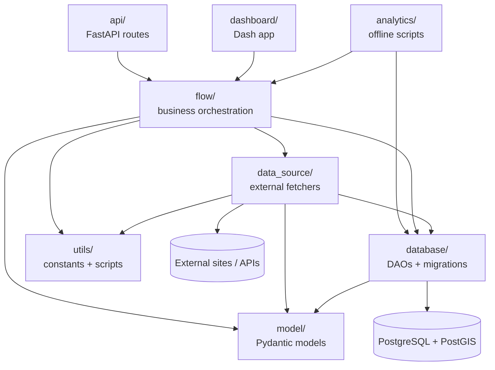

# 01 - Architecture and Code Structure

This document explains the layering of the codebase, what each folder is for,
the order to read files when you are learning the project, the rules about
which layer can import from which, and our naming and logging conventions.

## Layered dependency graph

We use a classic layered architecture. Arrows point in the direction of
allowed imports (`A -> B` means `A` may import from `B`, never the reverse).



### Import rules (cheat sheet)

- `model/` depends on nothing but Pydantic.
- `database/` may import from `model/` and nothing above it. It never imports
  from `flow/`, `api/`, `dashboard/`, or `analytics/`.
- `data_source/` may import from `model/`, `database/` (for persistence-oriented
  scrapers such as Landea), and `utils/`. It must return Pydantic `model/`
  objects, never raw dicts.
- `flow/` may import from `data_source/`, `database/`, `model/`, and `utils/`.
  Flows are the only layer allowed to combine fetching, persistence and
  statistics in one place.
- `api/` and `dashboard/` may import from `flow/` and `model/`. They must not
  touch `data_source/` or `database/` directly - always go through a flow.
- `analytics/` is a pragmatic exception: it imports `database.connection`
  directly so it can run tight, fast psycopg2 queries without the slow
  correlated-subquery path that lived in the flow layer. See the file-header
  note in [analytics/generate_plots.py](../analytics/generate_plots.py).

Keeping these rules holds the code testable and keeps DB semantics out of
HTTP handlers and UI callbacks.

## Folder-by-folder map

When you are ramping up, read one folder at a time, starting from the bottom
of the layer diagram (models) and moving up.

### `model/` - typed domain models

Every cross-layer payload is a Pydantic `BaseModel` defined here. Read, in
order:

- [model/geographical_model.py](../model/geographical_model.py) - `Point`,
  `Rectangle`, `Circle`. The coordinate primitives used everywhere.
- [model/asset_model.py](../model/asset_model.py) - `TargetAsset`, the generic
  asset representation that flows and the API accept.
- [model/spitogatos_asset_model.py](../model/spitogatos_asset_model.py) -
  `SpitogatosAsset`, the rich Spitogatos listing snapshot.
- [model/landea_asset_model.py](../model/landea_asset_model.py) -
  `LandeaAssetModel`, the Landea equivalent.
- [model/comparison_data_model.py](../model/comparison_data_model.py) -
  `ComparisonDataModel` returned by revaluation runs.
- [model/area_statistics_model.py](../model/area_statistics_model.py) -
  `AreaStatisticsModel`, the per-area price-per-sqm summary.
- [model/geojson_model.py](../model/geojson_model.py) -
  `GeoJsonFeatureCollection`, `GeoJsonFeature`, `GeographyLayers`.
- [model/spitogatos_analytics_models.py](../model/spitogatos_analytics_models.py) -
  analytics payloads (`AreaSummaryRow`, `DistributionBucket`,
  `AreaDistributionSeries`, `TrendPoint`, `TableDistributionPayload`, etc.).

### `database/` - persistence layer

- [database/config.py](../database/config.py) - env-driven
  `DatabaseConfig` dataclass.
- [database/connection.py](../database/connection.py) - `ThreadedConnectionPool`
  (min 1, max 10) wrapped by `DatabaseConnection`, with `get_cursor()` /
  `execute_query()` / `execute_update()` helpers. Always use
  `get_db_connection()` (singleton) rather than calling `psycopg2.connect`
  directly.
- [database/spitogatos_dao.py](../database/spitogatos_dao.py) - the largest
  DAO: upsert/search/analytics for `spitogatos_data`. Start here to see our
  DAO patterns.
- [database/landea_dao.py](../database/landea_dao.py) - DAO for
  `landea_assets` (stage 1 listings + stage 2 enrichment).
- [database/geography_dao.py](../database/geography_dao.py) - reads
  Athens neighborhoods / Attica municipalities back as GeoJSON.
- [database/load_athens_neighborhood.py](../database/load_athens_neighborhood.py) /
  [database/load_attica_municipality.py](../database/load_attica_municipality.py) -
  one-shot loaders from local GeoJSON into `geography.*` tables.
- [database/migrations/](../database/migrations/) - numeric-prefixed,
  idempotent `.sql` files executed by
  [database/setup.py](../database/setup.py). See
  [02_database.md](02_database.md) for the full schema.
- [database/asset_dao.py](../database/asset_dao.py) - DAO for
  `potential_assets` + `comparison_assets`.

### `data_source/` - external fetchers (scrapers/APIs)

One file per site. See [03_scraping.md](03_scraping.md) for a per-site tour.
At a glance:

- [data_source/spitogatos_data.py](../data_source/spitogatos_data.py) - JSON
  API (`/n_api/v1/properties/search-results`).
- [data_source/landea_data.py](../data_source/landea_data.py) - HTML scraping
  with Scrapy `Selector`, two-stage enrichment.
- [data_source/reinvest_data.py](../data_source/reinvest_data.py),
  [data_source/altamira_data.py](../data_source/altamira_data.py),
  [data_source/cerved_data.py](../data_source/cerved_data.py) - HTML scrapes.
- [data_source/reonline_data.py](../data_source/reonline_data.py),
  [data_source/eauctions_data.py](../data_source/eauctions_data.py) - thin
  helpers used by Excel enrichment flows.
- [data_source/geopy_data.py](../data_source/geopy_data.py) - Nominatim
  geocoding wrapper (`GeopyData`).
- [data_source/geography_data.py](../data_source/geography_data.py) -
  facade over `GeographyDAO` + `SpitogatosDAO` for polygon-scoped queries.
- [data_source/spitogatos_analytics_data.py](../data_source/spitogatos_analytics_data.py) -
  thin wrapper that normalises raw DAO dicts (Decimal/datetime) for the flow
  layer.

### `flow/` - business orchestration

- [flow/spitogatos_flow.py](../flow/spitogatos_flow.py) - the crown jewel.
  Fetch-all-polygon loops, radius-expansion revaluation, per-area analytics.
- [flow/geography_flow.py](../flow/geography_flow.py) - neighborhood /
  municipality boundary retrieval + polygon-scoped price statistics.
- [flow/landea_flow.py](../flow/landea_flow.py) - two-stage Landea pipeline
  (`run_stage1` lists, `run_stage2` enriches rows missing coordinates).
- [flow/reonline_flow.py](../flow/reonline_flow.py) - Excel `add_sqm`
  pipeline used by the API `/reonline/add-sqm` endpoint.

### `api/` - FastAPI

- [api/app.py](../api/app.py) - everything lives in one module, split into
  `geography_router`, `spitogatos_router`, `landea_router`, and the
  nested `spitogatos/analytics` router. Endpoints are documented in
  [06_api_and_dashboard.md](06_api_and_dashboard.md).
- `api/uploads/` - temp landing pad for user-uploaded Excel files.

### `dashboard/` - Dash UI

- [dashboard/app.py](../dashboard/app.py) - single-file Dash app
  ("VAR Opportunity Explorer"). Loads `040326-assets-stats.xlsx` (comparison
  output) and renders maps, sliders, tables with discount / score columns.
  it used to be our usefull dashboard, not anymore. 

### `analytics/` - offline PNG report generator

- [analytics/generate_plots.py](../analytics/generate_plots.py) - writes a
  folder tree under `analytics_output/` with per-metric per-area charts
  (histograms, trends, scatter relationships). Designed to be run inside
  the Docker container or the local venv.

### `utils/`

- [utils/consts/apis.py](../utils/consts/apis.py) - `ApisConsts` (shared
  `USER_AGENT` + the giant Spitogatos `Cookie` header).
- [utils/consts/greek_tems.py](../utils/consts/greek_tems.py) -
  `floor_level_dict` mapping Greek floor labels to integers.
- [utils/scripts/athens_neighborhoods_to_wgs84.py](../utils/scripts/athens_neighborhoods_to_wgs84.py) -
  one-off converter for Athens polygons to SRID 4326.
- [utils/scripts/athens_wgs84.json](../utils/scripts/athens_wgs84.json),
  [utils/scripts/attica_regions.geojson](../utils/scripts/attica_regions.geojson) -
  the geography sources, loaded by the `load_*` scripts.
- [utils/parse_excel.py](../utils/parse_excel.py) - Excel parsing helpers.

## Naming conventions

These are by convention, not by lint. Keep them when adding new code.

- `*_data.py` - an external fetcher (scraper or API client).
- `*_dao.py` - a DB access object. Holds all the SQL. Never imports from
  `flow/`.
- `*_flow.py` - orchestration class combining `data_source` + `database` +
  statistics. Exposes the verbs the API and dashboard want.
- `*_model.py` - Pydantic model definitions. No business logic.

Methods on scrapers use verb-first names: `get_by_location`, `get_by_id`,
`get_athens`, `get_polygon`. DAOs use `insert_list`, `insert_asset`,
`search_by_rectangle`, `search_by_circle`, `search_by_athens_neighborhood`.
Flows expose use-case names: `fetch_all_athens`, `get_assets_by_circle`,
`get_asset_statistics_by_radius`, `get_table_distribution`.

## Logging

Every module uses the stdlib `logging` package, never `print`:

```python
import logging

logger = logging.getLogger(__name__)
```

Entry-point modules (flows used as scripts, `analytics/generate_plots.py`,
`database/setup.py`) configure the root logger with a format string and a file
handler:

```35:42:flow/spitogatos_flow.py
logging.basicConfig(
    level=logging.INFO,
    format="%(asctime)s [%(levelname)s] %(message)s",
    handlers=[
        logging.FileHandler("debug.log"),
        logging.StreamHandler()
    ]
)
```

Non-entry-point modules never call `basicConfig` - they only call
`getLogger(__name__)` and let the entry point decide where logs go.

### Windows cp1252 gotcha

When logging Greek strings on a Windows console the process can die with
`UnicodeEncodeError`. We have a small helper in
[database/spitogatos_dao.py](../database/spitogatos_dao.py) you must use when
you are about to log user-supplied Greek text:

```15:19:database/spitogatos_dao.py
def _safe_log_text(text: str) -> str:
    """
    Make log text safe for Windows cp1252 consoles (keeps process from crashing on emoji).
    """
    return text.encode("cp1252", errors="backslashreplace").decode("cp1252")
```

Use it whenever you log a concatenated diff of potentially-Greek column values.

## Entry points you will actually run

- `python main.py --output-json landea_first_page.json` - quick Landea first
  page preview.
- `python database/setup.py` - run all migrations.
- `python -m uvicorn api.app:app --reload` - FastAPI dev server.
- `python dashboard/app.py` - Dash dashboard.
- `python analytics/generate_plots.py` - regenerate `analytics_output/`.
- `docker compose up --build` - DB + API together, migrations auto-run by
  [docker-entrypoint.sh](../docker-entrypoint.sh).

## Where to put new code

Use this table when you add a feature. Pick the narrowest layer.

- New site to scrape: `data_source/<site>_data.py` + `model/<site>_asset_model.py`.
- New DB table: new migration `database/migrations/00N_<name>.sql` +
  `database/<name>_dao.py`.
- New use case that combines fetch + persist + stats: `flow/<name>_flow.py`.
- New HTTP endpoint: a route in [api/app.py](../api/app.py) that calls the
  flow via `run_in_threadpool`.
- New chart on the dashboard: callback in [dashboard/app.py](../dashboard/app.py).
- Batch report job: new function in `analytics/generate_plots.py` (or a new
  script in `analytics/`).

When in doubt, add it to a flow and wire a thin endpoint on top. The flow is
where the team can read and review business logic without digging through SQL
or HTTP plumbing.
