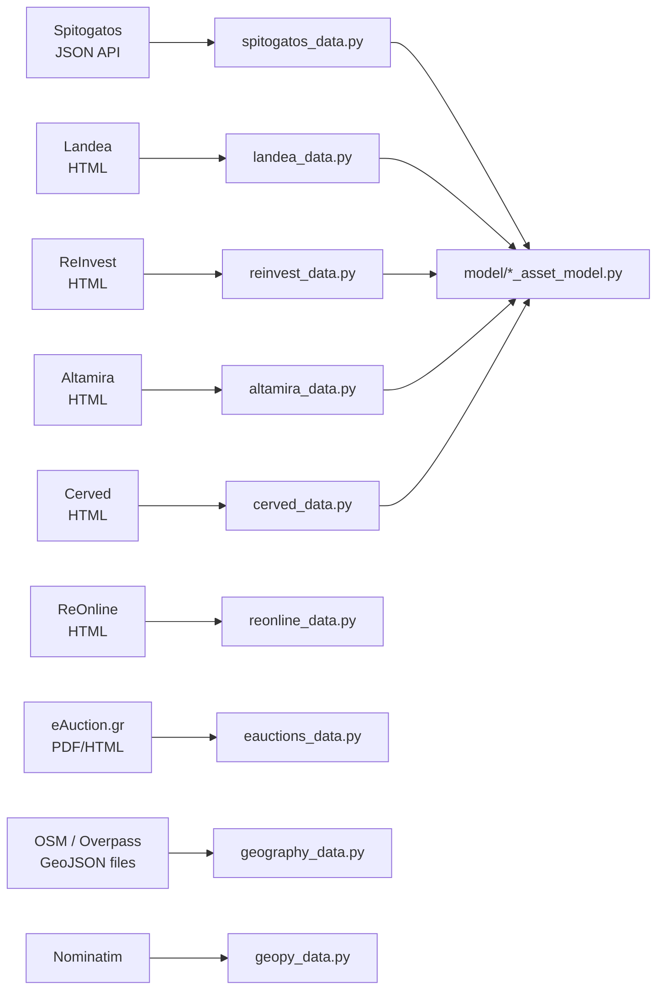

# 03 - Scraping

All external data fetching lives in [data_source/](../data_source/). One file
per site, one class per site, one Pydantic model per site. Flows never talk
HTTP; DAOs never talk HTTP. If you need to add a site, it is always a new
file here.

## Libraries we use (and why)

Pinned in [requirements.txt](../requirements.txt):

- `requests>=2.*` - every HTTP call goes through `requests.Session` so we get
  cookie persistence and connection pooling.
- `scrapy>=2.11.0` - we only use `scrapy.Selector` as an HTML parser. We do
  not run a Scrapy crawler; the reactor is never started. `Selector` wins
  over BeautifulSoup for complex CSS + XPath hopping.
- `beautifulsoup4>=4.12.0` - used by Cerved and ReInvest scrapers where we
  primarily extract text nodes and navigate parent/sibling chains.
- `geopy>=2.4.1` - Nominatim geocoding and great-circle math via
  `geopy.distance.distance(...).destination(...)`.
- `googletrans==4.0.0rc1` - used in [utils/parse_excel.py](../utils/parse_excel.py)
  to translate Greek columns/titles to English for the dashboard.
- `pandas`, `openpyxl`, `pyxlsb` - Excel input/output for the "by hand" and
  "Excel enrichment" flows.
- `urllib3.util.retry.Retry` + `requests.adapters.HTTPAdapter` - retry/backoff
  on transient 5xx (see Landea).

  We used sometimes also Selenium. feel free to move everything into Selenium if needed. 

## Sites we fetch



### Spitogatos ([data_source/spitogatos_data.py](../data_source/spitogatos_data.py))

The main market-comparables source. It uses Spitogatos's internal JSON API,
not HTML. Key methods:

- `get_by_location(rectangle, min_area, max_area)` - `GET
  https://www.spitogatos.gr/n_api/v1/properties/search-results?latitudeLow=...`
  with 30 results per page at zoom=18.
- `get_athens(offset)` - `POST` to the same endpoint with a `geoPolygons`
  payload covering Athens and `sortBy=rankingscore`.
- `get_polygon(offset)`, `get_polygon_north(offset)` - the same thing with
  different Attica polygons encoded in the request.
- `get_by_id()` - TODO, not implemented.

Every method returns a list of `SpitogatosAsset` or raises
`ConnectionAbortedError("Probably detected as bot.")` so the flow layer can
decide how to back off (the flows count two consecutive failures and stop).

Gotchas:

- **30-results-per-page cap.** Spitogatos returns at most 30 per request, so
  the `fetch_all_*` methods on `SpitogatosFlow` iterate offsets with
  `SPITOGATOS_PER_PAGE = 30`. There is a TODO at
  [data_source/spitogatos_data.py:22](../data_source/spitogatos_data.py)
  to investigate whether we can ever get more.
- **Browser headers are mandatory.** Without the full `sec-ch-ua`,
  `x-alsbn`, `x-locale`, `x-mdraw`, `Referer` and the real `User-Agent` from
  [utils/consts/apis.py](../utils/consts/apis.py), the server returns HTML
  or a 403. The `ApisConsts.SPITOGATOS_COOKIE` is a real cookie blob; we
  refresh it by hand when it stops working.
- **"Bot sneak" sleeps.** We call `sleep(3)` before `get_by_location` and
  `sleep(2)` between pages in the polygon/athens fetch loops. Do not
  parallelise these requests - keep sequential.
- **Raising over returning.** If the API returns 200 but no `data`, we
  assume bot detection and raise `ConnectionAbortedError`. This gives the
  flow a clean signal to stop, rather than silently returning `[]`.
- **Datetime formatting.** `website_modified`, `website_uploaded`,
  `firstPublishDate` come as `"%Y-%m-%d %H:%M:%S"` strings. Any change to
  that format will blow up `datetime.strptime`; wrap individual asset
  parsing in `try/except` and log the id before skipping (see how the
  existing code does it).

### Landea ([data_source/landea_data.py](../data_source/landea_data.py))

Greek auction portal. HTML-based, and uses a two-stage pipeline because the
search list does not include coordinates:

- **Stage 1: `scrape_all_search_pages` + `save_stage1_to_db`** - walk paginated
  search results, parse each card with `scrapy.Selector`, upsert rows into
  `landea_assets`. Driven by `LandeaFlow.run_stage1`.
- **Stage 2: `enrich_missing_in_db`** - pick rows where `lat`/`lon` is null,
  GET the detail page, regex out `var latitude = '...';` from the embedded
  JS, update the DB. Driven by `LandeaFlow.run_stage2` with a thread pool of
  5 workers.

Gotchas:

- **Retry adapter.** The Landea scraper wires a real `Retry(total=3,
  backoff_factor=1, status_forcelist=[500, 502, 503, 504])` on the session.
  Copy this pattern for any HTML scraper.
- **`main.py` first-page preview.** We keep a small standalone entry point
  that just re-uses `LandeaScraper._build_page_url` +
  `spider.parse_property` to produce a JSON snapshot of page 1. Useful for
  smoke-testing the scraper without touching the DB.
- **Dynamic icon parsing.** Landea renders features as icons; the text node
  next to each icon is how we distinguish sqm, bedrooms, bathrooms,
  construction year, floor and "feature" chips (`Storage`, `Parking`, ...).
  The regex ladder in `_parse_search_list_html` is deliberately ordered
  most-specific-first; do not reorder it casually.
- **Greek floor labels.** Detail pages sometimes show Greek floor labels.
  `utils/consts/greek_tems.py` has the `floor_level_dict` mapping; use it
  when you normalise floor strings.

### ReInvest ([data_source/reinvest_data.py](../data_source/reinvest_data.py))

HTML scrape with BeautifulSoup. `ReinvestData.scrape_listing(listing_id)` and
helpers. Coordinate extraction falls back through several strategies
(`_extract_coordinates`, `_find_coords_in_json`) because the site embeds
coords in different JSON blobs across listing types.

### Altamira ([data_source/altamira_data.py](../data_source/altamira_data.py))

`AltamiraData.scrape_listing(listing_id)` returns a `TargetAsset` (not a
site-specific model - Altamira listings are treated as generic market
comparables).

### Cerved ([data_source/cerved_data.py](../data_source/cerved_data.py))

The largest HTML scraper. Notable because:

- It paginates through the site listing index via
  `get_all_listing_ids(listing_url, max_pages)`.
- Per-listing parsing uses `BeautifulSoup("html.parser")` and returns
  `Tuple[TargetAsset, str, str]` (asset plus two extra text blobs that
  capture free-form fields like description/notes).
- It produces Excel output via `save_to_excel` for by-hand review before
  anything is pushed to the DB - our "human in the loop" for Cerved.

### ReOnline ([data_source/reonline_data.py](../data_source/reonline_data.py))

A two-line stub that just does `session.get(link)` and returns raw bytes as
"sqm" - we use it from `ReOnlineFlow.add_sqm` to add a sqm column to an
uploaded Excel file (`/reonline/add-sqm` endpoint). Note there's an existing
bug here: the stub does not actually parse the content, and the loop in
`ReOnlineFlow.add_sqm` iterates incorrectly (`row, index in df.iterrows()`
is reversed). If you touch this path, fix it.

### eAuctions ([data_source/eauctions_data.py](../data_source/eauctions_data.py))

Stub placeholder: `Eacutions_data.get_report(id)` is not implemented. Reports
from eauction.gr are currently fetched manually by the business team and
merged into the comparison Excel used by the dashboard.

### Geopy ([data_source/geopy_data.py](../data_source/geopy_data.py))

Nominatim wrapper exposing:

- `coords_from_address(address) -> Point` - forward geocode.
- `rectangle_from_point(point, radius_meters) -> Rectangle` - builds a
  square bounding box around a point using `geopy.distance.destination()`
  with 45 / 225 degree bearings, so you can feed spatial queries that
  expect a rectangle.
- `convert_location_to_lon_lat(location_str) -> Point` -
  `geopy.point.Point` parser for "lat,lon" strings.

Gotchas:

- Nominatim's public endpoint has a ~1 request/sec rate limit; do not
  parallelise geocoding.
- `user_agent='getloc'` is a placeholder - pass a real identifier before
  running this at scale, per Nominatim's policy.

### Geography + analytics facades

- [data_source/geography_data.py](../data_source/geography_data.py) -
  facade around `GeographyDAO` + `SpitogatosDAO.search_by_*` used by
  `GeographyFlow`. No HTTP.
- [data_source/spitogatos_analytics_data.py](../data_source/spitogatos_analytics_data.py) -
  facade around `SpitogatosDAO.get_area_*` used by the analytics endpoints;
  normalises psycopg2 `Decimal`/`datetime` values into Python `float`/`str`
  via `_cast_floats` so Pydantic + JSON serialisation stay simple.

## Patterns to reuse

### Every scraper method returns typed models

Not dicts. Not tuples of primitives. Always a `model/*_asset_model.py`
class. When you add a new site, add a model first.

### Headers live in `utils/consts/apis.py`

Do not duplicate cookies / user-agents per scraper. Put them in
[utils/consts/apis.py](../utils/consts/apis.py) so we can refresh them in
one place.

### Prefer `requests.Session` over `requests.get` directly

The session gives us cookie persistence across paginated requests. For
long-running scrapers mount a retry adapter:

```41:44:data_source/landea_data.py
        retries = Retry(total=3, backoff_factor=1, status_forcelist=[500, 502, 503, 504])
        adapter = HTTPAdapter(max_retries=retries, pool_connections=max_workers, pool_maxsize=max_workers)
        self.session.mount('https://', adapter)
        self.session.mount('http://', adapter)
```

### Radius-expansion over giving up

When a spatial query returns too little data, we re-query with a larger
radius before giving up. See `SpitogatosFlow.get_asset_statistics_by_radius`:

```563:580:flow/spitogatos_flow.py
        for i in range(4):
            assets = self.get_assets_by_circle(lon=asset.lon,
                                               lat=asset.lat,
                                               radius_meters=radius_meters,
                                               limit=limit,
                                               website_modified_from=website_modified_from,
                                               website_modified_to=website_modified_to,
                                               website_uploaded_from=website_uploaded_from,
                                               website_uploaded_to=website_uploaded_to,)
            if len(assets) < min_assets:
                logger.info("Not enough assets to compare with (%d) of radius %d", len(assets), radius_meters)
                radius_meters *= 1.3
            else:
                comparison_data = self.get_asset_statistics_by_comparisons(asset, assets)
                return comparison_data

        logger.info("Not enough assets near by to compare with. id: %s", asset.id)
        return None
```

Default: start 100m, x1.3, 4 attempts, need >=10 assets. Same pattern works
for scraping (widen the query box if you got too few listings).

### Fail-loud for bot detection

Scrapers raise `ConnectionAbortedError` when they detect anti-bot behaviour.
Flows handle it explicitly:

```98:116:flow/spitogatos_flow.py
            try:
                assets = self._spitogatos_data_source.get_polygon(offset=offset)
            except ConnectionAbortedError as e:
                consecutive_failures += 1
                logger.error(
                    "Bot detection or connection error on offset=%s (attempt=%s): %s",
                    offset,
                    consecutive_failures,
                    e,
                )
                if consecutive_failures >= 2:
                    logger.error(
                        "Stopping get_all_polygon after %s consecutive failures at offset=%s.",
                        consecutive_failures,
                        offset,
                    )
                    break
                # Retry same offset once more
                continue
```

Two consecutive failures == stop. Do not let a crashed scraper keep retrying
forever; you will get IP-banned.

### Translation is a separate pipeline

We do not translate inside scrapers. Translation happens later in
[utils/parse_excel.py](../utils/parse_excel.py) with `googletrans` when we
prepare the Excel files that feed the dashboard. Caveats:

- `googletrans==4.0.0rc1` is brittle; newer releases broke token fetching.
  If you upgrade, validate against the existing `all_assets.xlsx` first.
- Some `googletrans` calls return coroutines on certain versions; the code
  tolerates both with `getattr(result, "text", None)`.

## Known difficult issues across scrapers

- **Spitogatos cookies expire.** When `get_*` methods start returning empty
  `data` arrays across the board, first refresh
  `ApisConsts.SPITOGATOS_COOKIE` from a real browser session.
- **Zoom depends on bounding-box size.** `get_by_location` hard-codes
  `zoom=18` which only fits ~100m radii; for larger boxes the server
  aggregates into clusters and you get zero listings. There is a TODO to
  calculate zoom from the rectangle's diagonal.
- **OSM name_en mismatches.** Polygon joins (`search_by_athens_neighborhood`,
  `search_by_attica_municipality`) key on `name_en`; OSM sometimes updates
  names. If a known neighborhood suddenly returns 0 assets, first verify
  `SELECT name_en FROM geography.athens_neighborhood ORDER BY name_en`.
- **Duplicate ids within a batch.** Paginated scrapers can return the same
  id twice across consecutive pages during re-indexing windows. The DAO's
  `ON CONFLICT DO UPDATE` survives this, but if you batch two duplicates
  into the same call you get "command cannot affect row a second time".
  Dedupe on the conflict key before `insert_list`.
- **cp1252 console encoding.** Logging Greek text or emoji from a Windows
  terminal crashes the process unless you route it through
  `_safe_log_text()`. See [01_architecture.md](01_architecture.md#logging).
