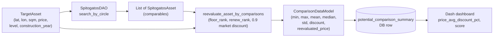

# 04 - Statistics and Revaluation

The entire point of the platform is to turn a candidate deal (a
**potential asset**) into a defensible price estimate. This doc explains how
we do that end-to-end: the radius-expansion comparable search, the pricing
formula, the aggregated output, and the per-area statistics that the
dashboard uses for context.

## Flow overview



## Radius-expansion comparable search

Entry point: `SpitogatosFlow.get_asset_statistics_by_radius` in
[flow/spitogatos_flow.py](../flow/spitogatos_flow.py).

- Start radius: 100 meters (`radius_meters: int = 100`).
- Minimum comparables: 10 (`min_assets: int = 10`).
- If the circle contains fewer than `min_assets`, multiply the radius by
  `1.3` and try again.
- Give up after 4 iterations; log the asset id and return `None`.

```563:580:flow/spitogatos_flow.py
        for i in range(4):
            assets = self.get_assets_by_circle(lon=asset.lon,
                                               lat=asset.lat,
                                               radius_meters=radius_meters,
                                               limit=limit,
                                               website_modified_from=website_modified_from,
                                               website_modified_to=website_modified_to,
                                               website_uploaded_from=website_uploaded_from,
                                               website_uploaded_to=website_uploaded_to,)
            if len(assets) < min_assets:
                logger.info("Not enough assets to compare with (%d) of radius %d", len(assets), radius_meters)
                radius_meters *= 1.3
            else:
                comparison_data = self.get_asset_statistics_by_comparisons(asset, assets)
                return comparison_data

        logger.info("Not enough assets near by to compare with. id: %s", asset.id)
        return None
```

With 1.3x expansion over 4 attempts the max radius is roughly 100 x 1.3^3 ~
219 meters. Past that we assume the area is too sparse to produce a trustable
estimate.

The final radius that succeeded is persisted to
`potential_comparison_summary.searched_radius`, so the dashboard can show
"this estimate used comparables within X meters".

## The comparison step

Given the final list of comparables,
`SpitogatosFlow.get_asset_statistics_by_comparisons` computes raw stats on
price-per-sqm and runs the revaluation formula:

```582:602:flow/spitogatos_flow.py
    def get_asset_statistics_by_comparisons(self, asset: TargetAsset,
                                            comparison_assets: List[SpitogatosAsset]) -> ComparisonDataModel:
        assert comparison_assets is not None
        assert len(comparison_assets) > 0
        assert asset is not None

        comparison_price_per_sqm = sorted(
            [(comparison_asset.price / comparison_asset.sqm) for comparison_asset in comparison_assets])
        no_assets = len(comparison_price_per_sqm)
        reevaluation = self.reevaluate_asset_by_comparisons(asset=asset, comparison_assets=comparison_assets)

        return ComparisonDataModel(no_assets=no_assets,
                                   reevaluated_price=reevaluation,
                                   min=comparison_price_per_sqm[0],
                                   max=comparison_price_per_sqm[-1],
                                   std=statistics.stdev(comparison_price_per_sqm) if no_assets >= 2 else 0.0,
                                   mean=sum(comparison_price_per_sqm) / no_assets,
                                   median=comparison_price_per_sqm[no_assets // 2],
                                   discount=(asset.price - reevaluation) / reevaluation,
                                   spitogatos_comparison_assets=[comparison_asset.id for comparison_asset in
                                                                 comparison_assets])
```

Things to note:

- `price_per_sqm` is the raw list of `price / sqm` from the comparables, not
  the revalued series. Min / max / mean / median / std are computed on this
  raw list.
- `median` uses `price_per_sqm[n // 2]`, not a true mid-two-elements average.
  That's intentional - we want a value that is an actual comparable, not an
  interpolation.
- `stdev` falls back to `0.0` if there are fewer than 2 comparables (only
  possible when `min_assets` is overridden).
- `discount = (asset.price - reevaluation) / reevaluation`. Negative means
  "asset priced below our fair-value estimate" - the attractive case.

## The revaluation formula

Implemented as a staticmethod on `SpitogatosFlow`:

```604:638:flow/spitogatos_flow.py
    @staticmethod
    def reevaluate_asset_by_comparisons(asset: TargetAsset, comparison_assets: List[SpitogatosAsset]) -> float:
        floor_rank = {
            -1: -0.4,
            0: -0.1,
            1: 0,
            2: 0.05,
            3: 0.1,
            4: 0.15,
            5: 0.20,
            6: 0.25,
        }
        renew_rank = {
            True: 0.2,
            False: 0,
        }
        revised_prices_per_sqm = []
        for comparison_asset in comparison_assets:
            price_per_meter = comparison_asset.price / comparison_asset.sqm
            # 10% down
            price_per_meter *= 0.9

            # level factor
            price_per_meter *= (1 - floor_rank.get(asset.level, 0.25))

            # renew factor
            price_per_meter *= (
                    1 - renew_rank.get((asset.construction_year > 2000), 0)) if asset.construction_year else 1
            revised_prices_per_sqm.append(price_per_meter)
        revised_mean = statistics.mean(revised_prices_per_sqm)
        asset_revised_price = revised_mean * asset.sqm
        asset_revised_price *= (1 + floor_rank.get(floor_level_dict.get(asset.level), 0.25))
        asset_revised_price *= (
                1 + renew_rank.get((asset.construction_year > 2000), 0)) if asset.construction_year else 1
        return asset_revised_price
```

### Formula in plain English

For each comparable:

1. Take `price / sqm`.
2. Apply a **10% market discount** (`* 0.9`) - the gap between asking price
   and realistic transaction price.
3. **Strip the comparable's floor and renewal premium using the target
   asset's profile** (subtract `floor_rank[asset.level]` and
   `renew_rank[asset.construction_year > 2000]`). This normalises every
   comparable to "what would this comparable cost if it had the target's
   floor / renewal profile?".
4. Average these adjusted price-per-sqm values -> `revised_mean`.

Then, for the asset itself:

5. `asset_revised_price = revised_mean * asset.sqm`.
6. **Add back** the target asset's own floor premium
   (`* (1 + floor_rank.get(floor_level_dict.get(asset.level), 0.25))`) and
   renewal premium.

The `0.25` default in `floor_rank.get(..., 0.25)` is the fallback when the
floor is higher than 6; we treat 7+ as "same premium as floor 6 plus a
margin".

Note the `floor_level_dict` in step 6: when looking up the asset's uplift we
go through
[utils/consts/greek_tems.py](../utils/consts/greek_tems.py) to translate
Greek floor labels like `'Ισόγειο'` (ground), `'Υπόγειο'` (basement),
`'Ημιυπόγειο'` (semi-basement) into the integer keys of `floor_rank`.

### Floor rank table

| level | Greek label                | rank  |
|------:|:---------------------------|------:|
| -1    | `Υπόγειο` / `Ημιυπόγειο`   | -0.4 |
| 0     | `Ισόγειο`                  | -0.1 |
| 1     | `1ος`                      |  0.0 |
| 2     | `2ος`                      |  0.05|
| 3     | `3ος`                      |  0.10|
| 4     | `4ος`                      |  0.15|
| 5     | `5ος`                      |  0.20|
| 6     | `6ος`                      |  0.25|
| 7+    | -                          |  0.25 (default) |

### Renewal rank table

| `construction_year > 2000` | rank |
|:---------------------------|-----:|
| True                       | 0.2 |
| False                      | 0.0 |

If `construction_year` is missing, the whole renewal multiplier is skipped
(`... if asset.construction_year else 1`).

## Output: `ComparisonDataModel`

Defined in [model/comparison_data_model.py](../model/comparison_data_model.py):

```1:14:model/comparison_data_model.py
from typing import List, Optional

from pydantic import BaseModel

class ComparisonDataModel(BaseModel):
    std: float
    min: float
    max: float
    mean: float
    median: float
    no_assets: int
    discount: Optional[float]
    reevaluated_price: Optional[float]
    spitogatos_comparison_assets: List[str] # ids
```

This is what the `POST /spitogatos/asset-statistics-by-radius` and
`POST /spitogatos/asset-statistics-by-comparisons` endpoints return.

## Persisting the revaluation: `potential_comparison_summary`

One revaluation run per `potential_asset_id`. Schema (from
[001_initial_schema.sql](../database/migrations/001_initial_schema.sql)):

- `assets_count` - `no_assets` above.
- `comparison_average`, `comparison_min`, `comparison_max`,
  `comparison_median`, `comparison_std` - raw price-per-sqm aggregates.
- `normalized_mean` - mean price-per-sqm **after** floor/renewal
  normalisation (equivalent to `revised_mean` from the formula).
- `revaluated_price_meter` - fair price per sqm.
- `revaluation_total_price` - `revaluated_price_meter * sqm`.
- `max_buy_price` - the highest bid we would pay, derived from
  `revaluation_total_price` with a target margin.
- `score` - composite opportunity ranking used by the dashboard.
- `searched_radius` - the radius that finally satisfied `min_assets`.
- `spitogatos_url`, `eauctions_url` - convenience deep links.

The current write path goes through offline by-hand runs that produce
`040326-assets-stats.xlsx`; the API returns live `ComparisonDataModel`
values but does not yet write to `potential_comparison_summary`. If you
wire a new persistence path, keep the schema intact - the dashboard reads
these column names directly.

## Dashboard-side derived metrics

The Dash app loads the comparison Excel and derives:

```87:106:dashboard/app.py
    df["price_per_sqm"] = pd.to_numeric(df.get("price/sqm"), errors="coerce")
    df["comparison_average"] = pd.to_numeric(df.get("comparison_average"), errors="coerce")
    df["score"] = pd.to_numeric(df.get("score"), errors="coerce")
    df["sqm"] = pd.to_numeric(df.get("sqm"), errors="coerce")
    df["price"] = pd.to_numeric(df.get("price"), errors="coerce")  # Changed from "Price" to "price"
    df["AuctionDate"] = pd.to_datetime(df.get("AuctionDate"), errors="coerce")
    df["searched_radius"] = pd.to_numeric(df.get("searched_radius"), errors="coerce")
    df["#assets"] = pd.to_numeric(df.get("#assets"), errors="coerce")
    df["comparison_min"] = pd.to_numeric(df.get("comparison_min"), errors="coerce")
    df["comparison_average"] = pd.to_numeric(df.get("comparison_average"), errors="coerce")
    df["comparison_median"] = pd.to_numeric(df.get("comparison_median"), errors="coerce")
    df["comparison_max"] = pd.to_numeric(df.get("comparison_max"), errors="coerce")

    # Changed from "precent_under_market" to "price_under_market"
    df["price-market_discount"] = pd.to_numeric(df.get("price_under_market"), errors="coerce") * 100
    comparison_safe = df["comparison_average"].replace({0: pd.NA})
    df["price_avg_discount_pct"] = (
        (comparison_safe - df["price_per_sqm"]) / comparison_safe
    ) * 100
```

- `price-market_discount = price_under_market * 100` - pre-computed by the
  offline pipeline, rendered as a percentage.
- `price_avg_discount_pct = (comparison_avg - price_per_sqm) / comparison_avg
  * 100` - the raw discount of the asset vs the local market mean. Note the
  `comparison_safe = df["comparison_average"].replace({0: pd.NA})` step -
  a `0` means "no comparables were found", not "market is free", so we must
  avoid dividing by zero.

## By-area analytics (neighborhood / municipality)

Separately from per-asset revaluation, we publish per-area summary rows,
histogram distributions, time trends and scatter relationships. The metrics
are a fixed vocabulary, enforced at the flow layer:

```45:47:flow/spitogatos_flow.py
_VALID_METRICS = {
    "upload_time", "floor_number", "price", "sqm", "price_per_sqm", "new_development"
}
```

The SQL expression for each metric lives in
[analytics/generate_plots.py](../analytics/generate_plots.py):

```63:70:analytics/generate_plots.py
METRIC_SQL = {
    "upload_time": "EXTRACT(EPOCH FROM (NOW() - s.website_uploaded)) / 86400.0",
    "floor_number": "s.floor_number::double precision",
    "price": "s.price::double precision",
    "sqm": "s.sqm::double precision",
    "price_per_sqm": "s.price::double precision / NULLIF(s.sqm, 0)",
    "new_development": "s.new_development::double precision",
}
```

### Summary table (`get_table_distribution`)

`SpitogatosFlow.get_table_distribution` produces
`TableDistributionPayload` (see
[model/spitogatos_analytics_models.py](../model/spitogatos_analytics_models.py)).
For each neighborhood and each municipality that contains listings it
returns an `AreaSummaryRow`:

- `n` - count.
- `min`, `max`, `mean`, `median`, `stddev`.
- `p10`, `p25`, `p75`, `p90`, `iqr = p75 - p25`.
- `cv = stddev / |mean|` (null if mean == 0).
- `skewness`, `kurtosis` - null when n < 30 (we do not trust shape
  statistics on tiny samples).

The computing path is the fast CTE + `PERCENTILE_CONT` / `STDDEV_SAMP`
query in `fetch_summary_df`; **do not reintroduce correlated subqueries here.**

### Distribution buckets

`AreaDistributionSeries` gives histogram counts per area against a globally
shared edge set (so every area's chart lines up on the same x-axis):

- For continuous metrics, 20 `width_bucket` edges across the global min/max.
- For `new_development`, we skip bucketing and use `[0, 1]` as a discrete
  "No / Yes" axis.

### Time trends (`get_analytics_trends`)

Grouped by `date_trunc('{granularity}', s.website_uploaded)` (`day`, `week`,
or `month`). For each area + period we return `n`, `mean`, `median`, `p25`,
`p75`. This is what powers "median price/sqm over time, by neighborhood" in
the dashboard.

### Relationships (`get_analytics_relationships`)

Random sample of up to `sample_limit` (default 3000) `(x, y)` pairs across
two metrics, with the neighborhood name as an optional colour key. The
canonical pre-built pairs used by `analytics/generate_plots.py` are:

```73:77:analytics/generate_plots.py
REL_PAIRS = [
    ("sqm", "price", "price_vs_sqm"),
    ("floor_number", "price_per_sqm", "price_per_sqm_vs_floor"),
    ("upload_time", "price", "price_vs_age"),
]
```

### Universal sqm filter

Every analytics query filters out listings outside a sane area range:

```85:91:analytics/generate_plots.py
SQM_MIN = 30
SQM_MAX = 200


def _sqm_range_predicate(alias: str = "s") -> str:
    # Shared filter for every query that sources listing rows.
    return f"{alias}.sqm > {SQM_MIN} AND {alias}.sqm < {SQM_MAX}"
```

The business rule: 30-200 sqm represents the residential segment we actually
care about. Listings outside this range are luxury / commercial outliers
and would distort every histogram.

## Polygon-scoped price-per-sqm (`GeographyFlow`)

For quick "what is the current mean price/sqm in Kifisia?" questions we have
a simpler route that skips all bucketing:

- `GET /geography/neighborhood-statistics?neighborhood_name_en=...`
- `GET /geography/municipality-statistics?municipality_name_en=...`

The flow computes a plain `AreaStatisticsModel` (`no_assets`, `min`, `max`,
`mean`, `median`, `std`) from `price / sqm` over all listings whose point
lies inside the polygon. Implementation in
[flow/geography_flow.py](../flow/geography_flow.py).

## Regenerating the offline PNGs

`analytics/generate_plots.py` produces seven per-metric folders under
`analytics_output/`:

- `upload_time/`
- `floor_number/`
- `price/`
- `price_per_sqm/`
- `sqm/`
- `new_development/`
- `relationships/`

Plus a zip: `analytics_output/analytics_output.zip`.

Run it locally against the venv:

```bash
python analytics/generate_plots.py
```

Or inside the API container (recommended because the DB is reachable at
`db:5432`):

```bash
docker exec realestateai-api python analytics/generate_plots.py
```

The file writes headlessly via `matplotlib.use("Agg")`, so this works over
SSH without a display.

## Checklist: adding a new metric

1. Add an SQL expression to `METRIC_SQL` in
   [analytics/generate_plots.py](../analytics/generate_plots.py) and to the
   `_METRIC_SQL` set in [flow/spitogatos_flow.py](../flow/spitogatos_flow.py).
2. Add the metric name to `_VALID_METRICS` so the flow rejects typos at the
   edge.
3. Add an entry to `_METRIC_LABELS` (flow) and `METRIC_LABELS` (analytics).
4. Decide whether the metric is continuous or discrete and update
   `fetch_distribution` accordingly (see the `new_development` branch).
5. Run `generate_plots.py` to smoke-test; verify the new metric folder
   contains histograms, trend charts, and that the dashboard's metric
   dropdown picks up the new option.

## Checklist: changing the revaluation formula

Revaluation is the core product. Anyone changing it must:

1. Edit `reevaluate_asset_by_comparisons` in
   [flow/spitogatos_flow.py](../flow/spitogatos_flow.py).
2. If the formula produces new fields, extend
   [model/comparison_data_model.py](../model/comparison_data_model.py).
3. If you need to persist new fields, add a migration that alters
   `potential_comparison_summary` (new columns, backfill with NULL) and
   wire the DAO to write them.
4. Run a regression against the existing Excel (`040326-assets-stats.xlsx`):
   reproduce at least 5 known assets and verify the `reevaluated_price`
   moves in the direction you expect.
5. Extend the dashboard numeric coercion (lines 83-106 of
   [dashboard/app.py](../dashboard/app.py)) for any new column.
