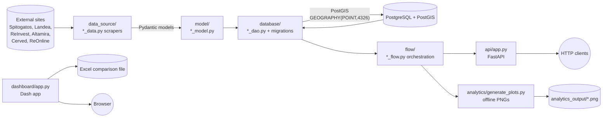

# RealEstateAI - Engineer Onboarding

Welcome. This folder is the single source of truth for how the RealEstateAI
platform is built, why it is built that way, and how to operate it. If you are
new on the team, read every file top-to-bottom in the order below. If you are
looking something up later, use the index at the end.

## What is RealEstateAI?

RealEstateAI is a PostGIS-backed real-estate intelligence platform focused on
the Greek market (Attica / Athens). It:

1. Scrapes public real-estate listings (Spitogatos, Landea, ReInvest, Altamira,
   Cerved, ReOnline, eAuctions) via site-specific data-source modules.
2. Normalises every listing into a typed Pydantic model and persists it in a
   PostgreSQL + PostGIS database with spatial (`GEOGRAPHY(POINT, 4326)`)
   indexes on `location`.
3. Joins listings against Athens neighborhood and Attica municipality polygons
   to compute per-area price-per-sqm statistics, distributions, trends and
   scatter relationships.
4. Revaluates candidate "potential assets" (deals we might buy) against nearby
   market comparables using a radius-expansion search and a floor-/renewal-
   weighted pricing formula.
5. Exposes everything as a FastAPI service (`api/`), a Dash dashboard
   (`dashboard/`) and an offline plot-generator (`analytics/`).

## Reading order

1. [01_architecture.md](01_architecture.md) - layered architecture, folder map,
   import rules, naming conventions, logging.
2. [02_database.md](02_database.md) - PostgreSQL + PostGIS schema, every
   migration, every DAO pattern with real SQL snippets, known DB issues.
3. [03_scraping.md](03_scraping.md) - sites we scrape, libraries, per-site
   quirks, anti-bot handling.
4. [04_statistics_and_revaluation.md](04_statistics_and_revaluation.md) - the
   revaluation formula, radius-expansion policy, aggregates, by-area metrics.
5. [05_geography.md](05_geography.md) - PostGIS GEOGRAPHY vs GEOMETRY, how
   neighborhoods and municipalities are loaded, spatial-query cookbook.
6. [06_api_and_dashboard.md](06_api_and_dashboard.md) - running the FastAPI
   service and the Dash dashboard, full endpoint inventory.
7. [07_operations_and_workflows.md](07_operations_and_workflows.md) - local
   and Docker setup, common developer workflows, best practices, open TODOs.

## High-level data flow

## Glossary

The terms below appear everywhere. Learn them first.

- **potential asset** - a candidate deal we are considering (from a portfolio
  we own/consider buying). Stored in `potential_assets`.
- **comparison asset** - a market listing used to price a potential asset.
  Stored in `comparison_assets`.
- **source** - where an asset originated (`spitogatos`, `landea`, `eauctions`,
  `reonline`, `cerved`, `altamira`, `reinvest`, `byhand`, ...).
- **portfolio** - the business grouping of potential assets (e.g. a bank's
  non-performing-loan bundle). Stored on `potential_assets.portfolio`.
- **revaluation / reevaluation** - our model's estimate of the fair market
  price of an asset given nearby comparables and asset-specific features
  (floor, construction year). Implemented in
  `SpitogatosFlow.reevaluate_asset_by_comparisons` in
  [flow/spitogatos_flow.py](../flow/spitogatos_flow.py).
- **revaluated_price_meter** - fair price per sqm from the revaluation model.
- **normalized_mean** - comparison mean price-per-sqm adjusted for the asset's
  floor/renewal profile.
- **max_buy_price** - the highest price at which we would still buy; derived
  from `revaluation_total_price` with a target margin.
- **score** - composite ranking of a potential asset vs its revaluation.
- **TargetAsset** - lightweight Pydantic model used throughout flows for any
  asset we want to evaluate; see
  [model/asset_model.py](../model/asset_model.py).
- **SpitogatosAsset** - full comparable listing model; see
  [model/spitogatos_asset_model.py](../model/spitogatos_asset_model.py).
- **ComparisonDataModel** - output of one comparison run (mean/median/std,
  reevaluated_price, discount, list of comparison ids). See
  [model/comparison_data_model.py](../model/comparison_data_model.py).
- **AreaStatisticsModel** - price-per-sqm summary for a polygon (neighborhood
  or municipality).
- **name_en** - the English name used as the join key for Athens
  neighborhoods and Attica municipalities.

## Project at a glance

- **Backend**: Python 3.12, FastAPI, Pydantic, psycopg2, pandas, matplotlib,
  Scrapy `Selector` (not the crawler), BeautifulSoup, geopy.
- **Database**: PostgreSQL 16 + PostGIS 3.4
  (image `postgis/postgis:16-3.4` in [docker-compose.yml](../docker-compose.yml)).
- **Delivery**: FastAPI on port 8000, Dash on port 8050, plus offline PNG
  reports.
- **Container image**: [Dockerfile](../Dockerfile) + [docker-entrypoint.sh](../docker-entrypoint.sh)
  runs `python -m database.setup` then `uvicorn api.app:app`.
